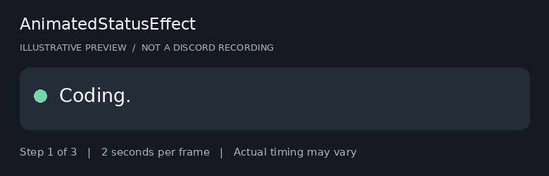
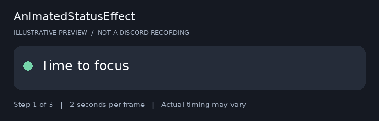

# Status examples

I keep these as text files so trying a different list just takes a copy and paste.

1. Open a `.txt` file in this folder.
2. Copy the lines into **AnimatedStatusEffect > Settings > Statuses**.
3. Choose an interval from 2 to 10 seconds, then save.

Each line is a separate step. No import button or code execution is involved. Gaming and focus messages are scripted examples; the plugin does not detect games, activity, or break times.

## Loading dots

## Focus messages

These GIFs are illustrative previews at two seconds per frame. They are not live Discord recordings or guarantees of update speed. The plugin defaults to ten seconds and respects server cooldowns.

A changing clock and executable JavaScript presets are not supported. Text emojis can be included in a status line; a separate custom-emoji selector is not included.
