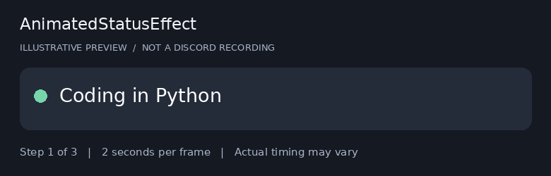

# AnimatedStatusEffect

A small BetterDiscord plugin for rotating custom status text. I kept the code in one file so it is easy to read and change.

Choose an interval from **2 to 10 seconds**. The default is **10 seconds**. Server cooldowns take priority, so the actual changes can take longer.

> Experimental: syntax and simulated behavior checks passed, but live Discord compatibility has not been verified. Personal-account automation can result in account termination under [Discord's policy](https://support.discord.com/hc/en-us/articles/115002192352-Automated-User-Accounts-Self-Bots).

## Preview

Illustrative preview at two seconds per frame, not a recording of Discord. Real updates may be delayed or rejected.

## Install

1. Install BetterDiscord from its [official website](https://betterdiscord.app/).
2. Download [AnimatedStatusEffect.plugin.js](AnimatedStatusEffect.plugin.js) using GitHub's **Download raw file** button. Keep the `.plugin.js` extension.
3. In desktop Discord, open **Settings > BetterDiscord > Plugins > Open Plugins Folder**.
4. Disable the earlier **SiamStatusRotator** plugin if it is installed.
5. Copy the new plugin file into the folder, enable **AnimatedStatusEffect**, and open its settings.
6. Enter one status per line, choose a whole number from **2 to 10**, and select **Save and restart rotation**.

On Windows the plugin folder is usually `%appdata%\BetterDiscord\plugins`.

## Examples

Open an example file and paste its entire contents into the plugin's **Statuses** box. These are plain-text lists, not configuration imports.

| Example | Contents |
| --- | --- |
| [Coding](Examples/coding.txt) | Python, JavaScript, and project updates |
| [Loading dots](Examples/loading-dots.txt) | Three steps: Coding., Coding.., Coding... |
| [Focus](Examples/focus.txt) | Work, break, and return messages |
| [Gaming](Examples/gaming.txt) | Queue, match, and break messages |
| [Personal projects](Examples/personal-projects.txt) | Portfolio and game development |

See the [example guide](Examples/README.md) for more previews.

## What it does

- Cycles through the list in order and loops back to the start.
- Accepts up to 128 characters per status and skips blank lines.
- Replaces the custom status, including its existing emoji.
- Keeps the last status visible when paused.
- Pauses on request errors and retains server cooldowns across restarts.
- Uses plain text only, with no executable presets, analytics, or automatic downloads.

It runs while desktop Discord and the plugin are active. Opening the settings and saving restarts the sequence. Disabling the plugin stops future updates; an already-sent request can still finish.

## Troubleshooting and development

Read [Troubleshooting](docs/TROUBLESHOOTING.md) for loading and rate-limit errors, or [Code guide](docs/CODE_GUIDE.md) to follow the implementation. The [risk notes](docs/ACCOUNT_RISKS.md) explain the difference between enforcement and account compromise.

## Reference

The folder layout was inspired by [toluschr/BetterDiscord-Animated-Status](https://github.com/toluschr/BetterDiscord-Animated-Status). This package contains our plugin and original examples and preview graphics. It does not include the reference project's source files or screenshots.
